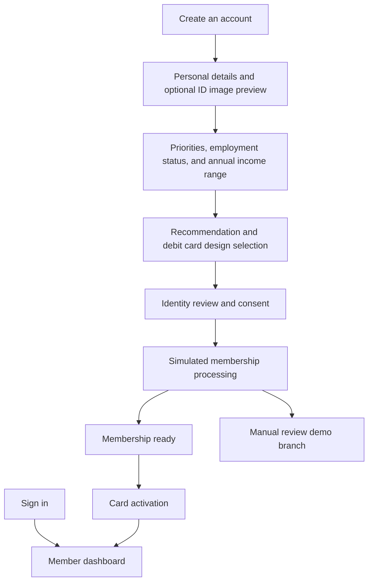
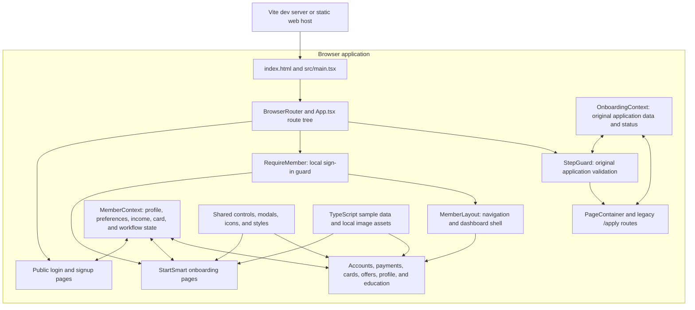

# UFCU StartSmart

A responsive banking and member-onboarding prototype built for the DevelopU Hackathon with React, TypeScript, and Vite. StartSmart brings account setup, debit card selection, a member dashboard, recurring-payment switching, and security education into one experience.

## Run locally

Use Node.js **22.12 or later** and npm. No API keys, database, or environment variables are required.

```sh
npm ci
npm run dev
```

Open [http://127.0.0.1:5173](http://127.0.0.1:5173).

For a quick demo, sign in with `member@example.com` and `demo-password`. Sign-in goes **directly to the dashboard**. This is simulated authentication: any nonempty email or username and a password of at least four trimmed characters pass the local check.

Choose **Create an account** to explore the complete onboarding journey.

## Member journeys



Onboarding includes:

- Personal and contact details, identification type, and last-four ID and SSN values.
- Optional JPG, PNG, or WebP image preview, up to 5 MB, with replacement and removal.
- Banking priorities, an employment/student-status dropdown, and optional minimum/maximum annual income. Income accepts zero and validates that the maximum is at least the minimum.
- University of Texas, Texas State University, and UFCU Classic debit card artwork. The selected design carries into identity review and card activation.
- Review, consent, simulated processing, and membership-ready/manual-review screens.

## Member features

| Feature | Current behavior |
| --- | --- |
| Dashboard | Illustrative balances, upcoming payments, recent activity, and setup progress |
| Accounts | Account details with masked numbers and an explicit reveal control |
| Move Money | Transfer review and a menu for transfer, send, receive, and direct deposit |
| Smart Switch | Select a bank, review recurring payments, and prepare a switch request; direct deposit is a separate flow |
| Direct Deposit | Employer selection, simulated secure handoff, paycheck details, and setup confirmation |
| Cards & Wallet | Selected card artwork, simulated activation, and wallet setup |
| Financial Insights | Illustrative cash-flow and spending charts |
| Nearby Offers | Merchant rows and map pins open discount details, expiration, instructions, and terms |
| Learn AI | Prewritten security guidance selected through topics or keyword matching |
| Profile | Member information and editable profile fields |
| Navigation | Feature search, notifications, and responsive desktop/mobile navigation |

Nearby Offers currently contains **non-redeemable demo offers**: H-E-B ($5 back on $50), Target (10% back on $30, capped at $10), and Local Coffee ($2 off $8). The location and ZIP controls switch local UI state; they do not call a geolocation or merchant service.

## System architecture

The current system is a **client-side single-page application**. Vite serves it during development and builds static assets for deployment. React Router manages navigation, React context holds shared state, and individual components hold temporary UI state. There is no backend or database in this repository.



### Responsibilities and state

| Layer | Implementation | Responsibility |
| --- | --- | --- |
| Entry and routing | `src/main.tsx`, `src/App.tsx` | Mount React, install providers, and map routes |
| Member state | `src/context/MemberContext.tsx` | Profile, local sign-in flag, priorities, employment/income, selected card, consent, and membership stage |
| Original application state | `src/context/OnboardingContext.tsx` | Separate `/apply/*` form data, submission status, and reset behavior |
| Route guards | `RequireMember`, `StepGuard` | Redirect unsigned-in visitors and enforce original application step order |
| Layout | `MemberLayout`, `MemberSetupShell`, `PageContainer` | Member shell, setup screens, and original application shell |
| Feature UI | `src/pages/`, `src/components/` | Render screens and handle user interactions |
| Validation and sample data | `src/lib/`, `src/data/`, `src/types/` | Original application validation, static product data, and TypeScript models; newer forms also validate locally in their pages |
| Styling and assets | CSS files, `src/assets/`, `public/images/cards/` | Responsive presentation, logos, and debit card artwork |

**Data lifecycle:** shared contexts live in memory and survive client-side navigation. Refreshing the browser resets the application; there is no local-storage or server persistence. Selected ID images use browser object URLs only, are never uploaded, and are released when replaced, removed, or when the signup page unmounts. Signup passwords are omitted from the member profile stored in context.

**Interaction example:** choosing an employment status updates `MemberContext`; continuing validates the income range and saves priorities; the recommendation page saves the selected card; identity review reads these values from the same context; card activation updates the membership stage before opening the dashboard. Opening a nearby offer uses page-local state and a native modal dialog with keyboard dismissal and focus restoration.

### Prototype boundaries and future integrations

All authentication, membership decisions, account balances, transfers, payment switching, direct deposit, wallet actions, and offers are local demonstrations. Route guards are navigation controls, not server-side authorization. Learn AI does not call an LLM. Card-design availability is illustrative, not a verified eligibility decision.

A production implementation would need authenticated backend APIs, persistent storage, server-side validation and authorization, secure identity-document handling, and integrations for account opening, banking, payroll, wallets, and merchant offers. Those services and an API adapter layer have **not** been implemented. Use sample information when exploring the prototype.

## Main routes

| Routes | Purpose |
| --- | --- |
| `/`, `/signup` | Sign-in and account creation |
| `/preferences`, `/recommendation`, `/identity-review` | Personalization, card selection, and review |
| `/membership-processing`, `/membership-ready`, `/membership-needs-review` | Simulated membership decisions |
| `/dashboard`, `/accounts`, `/move-money` | Overview, account details, and transfer review |
| `/smart-switch`, `/direct-deposit`, `/cards-wallet` | Payment switching, payroll setup, and cards |
| `/financial-insights`, `/nearby-offers`, `/learn-ai`, `/profile` | Insights, offers, education, and profile |
| `/architecture`, `/rubric-proof`, `/trust-nav` | In-app reference and demonstration pages |
| `/apply/*` | Original account-opening flow retained alongside StartSmart |

## Project structure

```text
src/
  main.tsx                    React entry point and BrowserRouter
  App.tsx                     Providers, route tree, and legacy step guard
  components/
    common/                   Buttons, icons, and reusable modal
    forms/                    Form fields and local ID image preview
    layout/                   Member navigation and page shells
    switching/                Smart Switch recurring-payment flow
  context/                    Member and original onboarding providers
  data/                       Accounts, funding, steps, states, and security tips
  lib/                        Original application validation and unit tests
  pages/                      Auth, onboarding, dashboard, and member features
  types/                      Member and original application data models
  styles.css                  Shared and responsive styling
  startsmart-flow.css         StartSmart journey styling
  member-interactions.css     Member panels and interaction styling
public/images/cards/          Debit card artwork and source attribution
tests/onboarding.spec.ts     Browser tests for member journeys and interactions
```

Card artwork sources are listed in [public/images/cards/SOURCES.md](public/images/cards/SOURCES.md).

## Build and test

```sh
npm run build                 # TypeScript checking and Vite production build
npm test                      # Vitest validation tests
npx playwright install chromium
npm run test:e2e               # Playwright browser tests
npm run preview               # Serve the production build locally
```

Playwright starts or reuses the local server at port 5173. On Windows, the current configuration uses Microsoft Edge (`msedge`), which must be installed; other platforms use Playwright Chromium. Browser tests cover signup, income validation and retention, card selection, direct sign-in, member interactions, image preview, mobile layout, and merchant-offer dialogs.

The production build is written to `dist/`. A static host must serve `index.html` for application routes so direct links work with `BrowserRouter`.

## Team workflow

```sh
git switch main
git pull origin main
git switch -c feature/<short-description>
# Make and verify changes, then commit and push the feature branch.
```

Use a pull request to review and merge feature work into `main`. Run the build and checks relevant to the change before merging.
